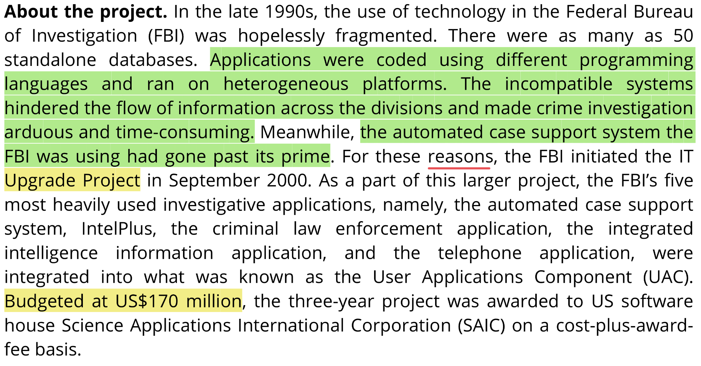
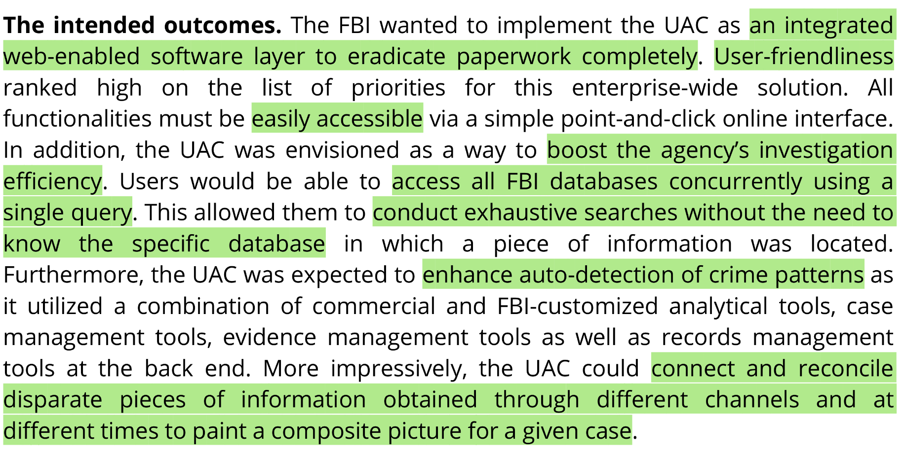
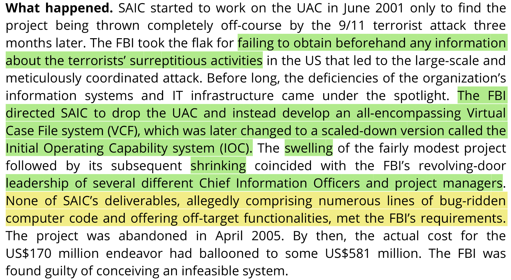
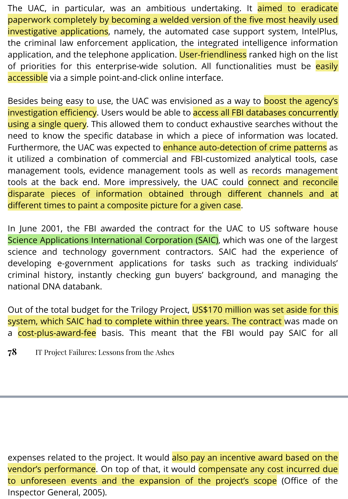
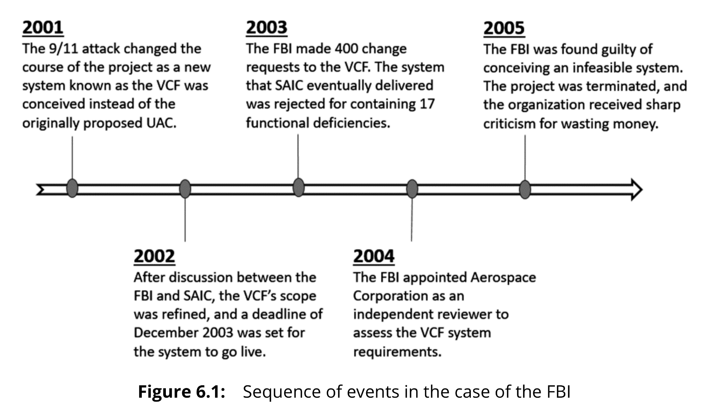

# The Case of the Federal Bureau of Investigation

* [The Case of the Federal Bureau of Investigation](#The-Case-of-the-Federal-Bureau-of-Investigation)
  * [Case Summary](#Case-Summary)
  * [Company Background](#Company-Background)
  * [Project Background](#Project-Background)
  * [Case Description](#Case-Description)
  * [Analysis](#Analysis)
    * [Cost: Little fiscal prudence](#Cost-Little-fiscal-prudence)

## Case Summary

## Company Background

The Federal Bureau of Investigation (FBI) was founded as the US national security agency in 1908.

Main aims of FBI:

* protest the American people and their civil rights
* uphold the US Constitution

Duties of FBI: Counterterrorism, foreign intelligence operations, and etc.

56 field offices and over 300 satellite offices.

**<u>The FBI is known to spare no expense when it comes to pursuing technological innovations, particularly in cutting-edge technologies.</u>**

## Project Background

## Case Description

## Analysis

### Cost: Little fiscal prudence

When the **<u>post-9/11</u>** national sentiment to fight terrorism went into an overdrive, it was **<u>easy to</u>** see why the Congress, in the name of homeland security, provided **<u>funds liberally to the FBI</u>**. Flushed with **<u>seemingly inexhaustible financial resources</u>** in its war chest to build the VCF, **<u>the FBI had little incentive to exercise fiscal prudence throughout the project</u>**.

**<u>Each time the funds were running low, all the FBI had to do was to ask for more.</u>** Perhaps, the high importance and urgency of the project had muted the voices of critics among those holding the purse-string in the Congress. Money continued to be poured into the VCF even though the signs of the project were hardly propitious.

The FBI **<u>could have cut its losses and aborted the project</u>**, especially when the VCF was found to be plagued with several functional deficiencies. Yet, it was apparently **<u>too anxious to show some quick results</u>**. Instead of committing upfront to another US\$16.4 million on the IOC, it could have at least waited for the report from the independent reviewer Aerospace Corporation, who was further paid US\$2 million.
