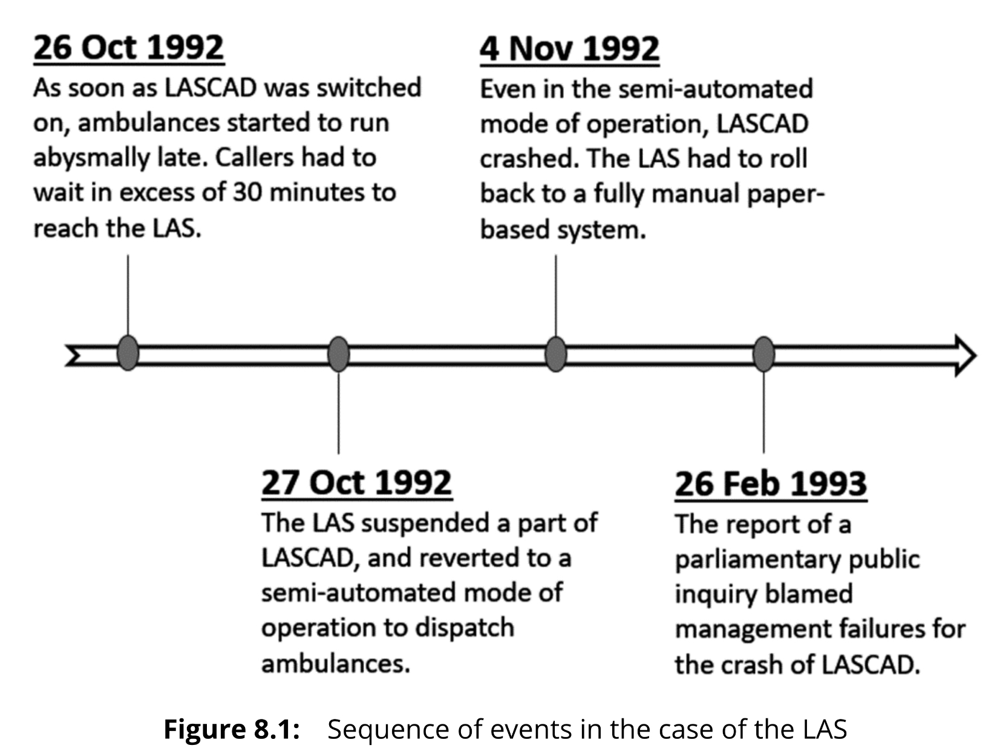

# The Case of the London Ambulance Service

* [The Case of the London Ambulance Service](#The-Case-of-the-London-Ambulance-Service)
  * [Case Summary](#Case-Summary)
    * [About the project](#About-the-project)
    * [The intended outcomes](#The-intended-outcomes)
    * [What happened](#What-happened)
  * [Company Background](#Company-Background)
  * [Project Background](#Project-Background)
  * [Case Description](#Case-Description)
  * [Analysis](#Analysis)
    * [Cost](#Cost)

## Case Summary

### About the project

<table>
    <tr>
        <td>Objective</td>
        <td>to improve the efficiency of the London Ambulance Service (LAS) through automation</td>
    </tr>
    <tr>
        <td>Project Name</td>
        <td>London Ambulance Service Computer-Assisted Dispatch (LASCAD)</td>
    </tr>
    <tr>
        <td>Vendor</td>
        <td>a consortium led by Apricot Computers</td>
    </tr>
    <tr>
        <td>Overall Budget</td>
        <td>£1.5 million</td>
    </tr>
</table>

### The intended outcomes

Overall: to automate the time-consuming, labor-intensive, and error-prone activities

1. to support computer-assisted ambulance dispatch that could:
   * receive calls
   * complete necessary verifications including location identification
   * allocate the nearest ambulances to the incidents
   * manage vehicles and crew
   * monitor the status of the requests
2. to reduce the average emergency-response time to three minutes

### What happened

* The initial deadline of January 1992 was not met.
* LASCAD went live only on 26 Oct. 1992.
* LASCAD faced a deluge of problems:
  * abysmal late in ambulance running
  * over half an hour waiting time for callers
  * a mass of automatic alerts
  * slowed-down performance with an increasing of alerts
* LAS address the situation by reverting to a semi-automated mode of operation.
* LASCAD crashed again on 4 Nov. 1992.
* The LAS rolled back to the previous fully manual system.

## Company Background

The London Ambulance Service (LAS) was founded in 1965 as a part of the establishment of the Greater London  Council. Its purpose was to provide emergency response to the city of London. In 1974, it became a quasi-independent body with its own board managed by the South Thames Regional Health Authority under the auspices of the National Health Service (NHS), England's public healthcare system. A high point in the history of the LAS was marked by a royal visit by Princess Diana in 1989. The LAS has gone on to become one of the largest and busiest ambulance services in the world.

The LAS has headquarters at five locations across London. Serving an area of approximately 620 square miles, it aims "to care for people in London: saving lives; providing care; and making sure they get the help they need" (London Ambulance Service, 2017, Our purpose and values). As an integral part of the healthcare ecosystem in London, the LAS works closely with hospitals to provide accident and emergency response. It also offers non-emergency services such as assisting patients to find hospital beds, taking patients to medical appointments, and helping to prevent as well as control the spread of infections. On a typical day, it ferries over 5,000 patients and receives up to 2,500 calls of which some 1,600 are emergency requests. Managing some 70 ambulance stations, it supports the likes of London Fire Brigade, the National Ambulance Procurement Hub, the NHS London Procurement Programme, the Office of Government  Commerce, Civil Defence Authority, and Metropolitan Police. It was also responsible in facilitating London 2012 Olympic and Paralympic Games.

Despite the LAS' importance throughout its long history, its track record is a mixed bag. On the positive side, its ambulance crew reached 63.81% of the severely ill patients such as victims of cardiac arrest accidents and shootings within eight minutes between April 2015 and March 2016. When the Care Quality Commission - the independent regulator of all health and social care services in England - inspected the LAS in 2015, it gave the service a good rating.

However, the LAS' experience with technology has been fraught with challenges. In the 1980s, it tried to computerize a part of its manually operated emergency dispatch system. The contract was awarded to International Aerdio Ltd. - a subsidiary of British Telecom, and Cap Gemini Sogeti. The project was terminated in 1990 after two tests of peak load performance failed miserably. The LAS accused the vendors of failing to understand the requirements of the project while the vendors blamed the LAS for changing the specifications incessantly. The parties eventually reached an out-of-court settlement.

## Project Background

The LAS faced a tempestuous time in the early 1990s. With a major change in the top management, it was organizationally restructured down from four divisions to three. In the process, it lost close to 20% of its veteran leaders and experienced staff members. To make matters worse, a battle between the management and the Trade Union ensued over issues such as salary and working conditions.

When John Wilby took over as Chief Executive of the LAS in July 1990, he was **<u>keen to revive the previously unsuccessful computer-assisted ambulance dispatch system</u>**. He saw it as the single most important element in improving the service of the LAS as the existing manual procedure was menacingly archaic.

The outdated procedure comprised four steps. First, on receiving a call for service, an employee at the LAS call center would pen down the details of the incident on a pre-printed form. The completed form was transferred to a central collection point using a conveyor belt. Second, another employee at the collection point had to look through the details of the incident. Based on its location, the incident was passed to one of the four regional resource allocators of the LAS. Third, the appropriate resource allocator would check the status and location of ambulances in the region to determine a vehicle that can be allocated to the incident. The details of the vehicle were inserted on the form. Finally, the form was sent to yet another employee who had to contact the relevant ambulance station where the allocated vehicle was expected to be stationed, or to communicate with the radio operator if the ambulance was known to be mobile.

**<u>Wilby recognized the futility of using manually laborious procedures to cope with the ever-growing ambulance demand. Thus, the London Ambulance Service Computer-Assisted Dispatch system (LASCAD) project was initiated.</u>** The idea was to automate the time-consuming, labor-intensive, and error-prone activities such as spotting the exact location of incidents, identifying possible duplicate calls,  managing communication holdups, getting in touch with the available resources, and deploying ambulances as well as crew in a timely manner. The estimated budget was £1.5 million.

A project committee was formed comprising a Director of Support Services, a Control Room Services Manager, a  System Manager, and a contract-based System Analyst. After finalizing the system requirements, the LASCAD project committee proceeded with the vendor selection process. In June 1991, it picked a consortium led by Apricot Computers, a hardware supplier owned by Mitsubishi. Apricot Computers was responsible for the overall project management but it could only handle the hardware components. The software development part was relegated to Systems Options, a small software house in the UK.

The LAS was uncomfortable with the ambiguous line of accountability within the consortium. Moreover, it was still haunted by the memory of the problematic software that led to the failure of the previous system. After much effort, the LAS managed to persuade Systems Options to take over the project leadership from Apricot Computers. It was a gamble for the LAS not just because Systems Options was a small outfit. **<u>The software house actually had no prior experience in developing large-scale, real-time, and safety-critical systems and the likes of LASCAD. The IT systems it delivered for the fire and police services were only small and simple administrative applications.</u>**

**<u>The quoted price of the software component of LASCAD was £35,000. The scope included receiving calls made to the LAS contact number 999, allocating ambulances to incidents automatically on the basis of available resources, and monitoring the status of the requests.</u>** When fully implemented, LASCAD was expected not only to ease the burden of manual processes but also reduce the average emergency-response time to three minutes, a target that was certainly out-of-reach for human dispatchers.

Undoubtedly, this was **<u>a lofty vision</u>**. **<u>A system to automatically propose and deploy available resources to incidents had never been attempted earlier by any emergency service in the UK.</u>**

The LASCAD project committee prepared the system design specification in July 1991. It was intended to support the following functionalities: (a) accept calls made to 999, (b) complete necessary verifications including location identification, (c) identify the nearest ambulances that should be dispatched to the incidents with the help of an automatic vehicle locating technology, (d) communicate with the ambulance crew to convey necessary details, (e) manage vehicles as well as crew to reduce response time, (f) receive acknowledgments whenever ambulance arrives at the patient's location or reaches the hospital, and (g) archive all information in the workflow to monitor performance. A deadline of January 1992 was set (Beynon-Davies, 1999).

By December 1991, the LASCAD project committee began to realize that it was working toward an impossible deadline. It could only manage to implement a partial system in January 1992 in the Northeast division of London. Even after using LASCAD for two months, the staff remained apprehensive of the system. Pushing user sentiments aside, the development team forged on and eventually LASCAD went live in October 1992.

## Case Description

## Analysis

### Cost

* Improper cost estimation
* Poor budgetary control

It is important to point out that the budget for LASCAD was much lower than that for the failed computerized dispatch system attempted earlier by the LAS in the 1980s. By the time the project was cancelled, the accumulating costs escalated to £7.5 million. Yet, the LAS estimated the cost of the new version, which was more technologically advanced than the failed one, to be only about £1.5 million. **<u>Perhaps, the LAS did not employ an analogous approach for cost estimation, which relies on the actual cost of similar historical projects (Heemstra, 1992).</u>**

One possibility is that the LAS might have employed bottom-up cost estimation. In this approach, the cost of every individual component is estimated first. The individual costs are added to estimate the total cost (Boehm et al., 2000). **<u>Even if such an approach was followed, it is appalling to note that the budget allocated for the software component of LASCAD was only £35,000, less than 5% of the total estimated cost while the rest was reserved for hardware.</u>** In a supposedly software-intensive system, the software component of the project was ironically just a cheap throw-in in a hardware-centric deal with a hardware supplier. **<u>This is an example of a gross mistake in managing costs, and poor budgetary control (Dalcher, 1999; Dobson, 2007). On such a shoe-string budget, LASCAD was never financially feasible in the first place.</u>**

